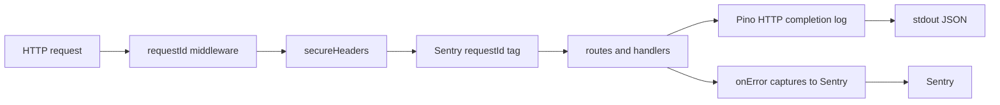

# R0 API Observability Design

## Goal

The API process emits Pino JSON structured logs and reports errors to Sentry, both correlated by `requestId`. Common middleware adds secure headers beside the existing request ID.

## Documentation and standard methods

| Capability | Official sources | Selected standard method | Reason |
| --- | --- | --- | --- |
| Secure headers | https://hono.dev/docs/middleware/builtin/secure-headers, https://hono.dev/docs/guides/middleware | `secureHeaders()` from `hono/secure-headers` with defaults | Built-in Hono middleware; project defaults require secure headers. |
| Structured logging | https://getpino.io/#/docs/api, https://hono.dev/docs/middleware/third-party | `pino()` + Hono custom middleware with `logger.child({ requestId })` | Confirmed R0 decision; Hono lists Pino as a third-party option without mandating a package; custom middleware matches the approved record shape. |
| Sentry | https://docs.sentry.io/platforms/javascript/guides/node/, https://docs.sentry.io/platforms/javascript/guides/node/configuration/apis/ | `@sentry/node` `Sentry.init`, `Sentry.setTag`, `Sentry.captureException`, `Sentry.close` | Official Node.js SDK; empty DSN leaves the client disabled for local development; `close` flushes on shutdown. |
| Config schema | https://zod.dev/api | Zod object fields on existing `apps/api/src/config.ts` | Extends the current loader; avoids a premature move to `src/config/env.ts`. |

## Components

- `apps/api/src/config.ts` loads `ENVIRONMENT`, `RELEASE`, and optional `SENTRY_DSN` with database settings.
- `apps/api/src/observability/logger.ts` creates a Pino logger with base bindings `service: "api"`, `environment`, and `release`. Destination defaults to stdout.
- `apps/api/src/observability/sentry.ts` initializes Sentry when `SENTRY_DSN` is non-empty, and exposes `closeSentry`.
- `apps/api/src/observability/request-middleware.ts` sets Sentry `requestId` tag and writes the HTTP completion log after `next()` with `method`, `route`, `status`, and `duration`.
- `apps/api/src/app.ts` registers middleware in order: request ID, secure headers, observability middleware, then routes. `onError` captures the exception to Sentry before returning the existing error JSON.
- `apps/api/src/index.ts` loads config, initializes Sentry and the logger, creates the app, and wires shutdown to close the server, pool, and Sentry.
- `apps/.env.example` documents `ENVIRONMENT`, `RELEASE`, and `SENTRY_DSN`.

## Log record

Each HTTP completion log includes:

- `timestamp` (Pino time)
- `level`
- `service` (`api`)
- `environment`
- `release`
- `requestId`
- `method`
- `route`
- `status`
- `duration` (milliseconds)

Owner identifiers are omitted until Cognito authentication exists.

## Configuration

| Variable | Rule |
| --- | --- |
| `ENVIRONMENT` | Required non-empty string |
| `RELEASE` | Required non-empty string |
| `SENTRY_DSN` | Optional; empty or absent disables Sentry |

## Verification

- Existing health, OpenAPI, request ID, and error contract tests continue to pass.
- A request with a destination-backed logger produces a JSON log containing the shared fields and the request ID.
- Secure header `X-Content-Type-Options: nosniff` is present on responses.
- Config tests cover required environment and release values and optional Sentry DSN.
- `onError` invokes Sentry capture when a route throws (test double).
- `npm test` and `npm run build` succeed.
