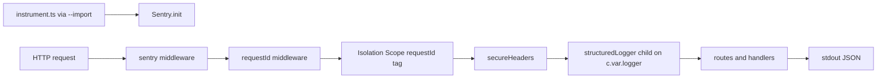

# R0 API Observability Design

## Goal

The API process emits Pino JSON structured logs and reports errors to Sentry, both correlated by `requestId`. Common middleware adds secure headers beside the existing request ID.

## Documentation and standard methods

| Capability | Official sources | Selected standard method | Reason |
| --- | --- | --- | --- |
| Secure headers | https://hono.dev/docs/middleware/builtin/secure-headers, https://hono.dev/docs/guides/middleware | `secureHeaders()` from `hono/secure-headers` with defaults | Built-in Hono middleware; project defaults require secure headers. |
| Structured logging | https://getpino.io/#/docs/api, https://github.com/honojs/middleware/tree/main/packages/structured-logger | `pino()` + `@hono/structured-logger` with `rootLogger.child({ requestId })` on `c.var.logger` | Official Hono structured-logger pattern; request-scoped child logger is available to handlers. |
| Sentry | https://docs.sentry.io/platforms/javascript/guides/hono/ | `@sentry/hono` with `@sentry/hono/node` `instrument.ts` loaded via `--import`, `sentry(app)` middleware, and `getIsolationScope().setTag('requestId', …)` | Official Hono SDK; ESM requires init before app imports; isolation scope correlates request events. |
| Config schema | https://zod.dev/api | Zod object fields on existing `apps/api/src/config.ts` | Extends the current loader; avoids a premature move to `src/config/env.ts`. |

## Components

- `apps/api/src/instrument.ts` initializes `@sentry/hono/node` when `SENTRY_DSN` is set, loaded before the app through `--import`.
- `apps/api/src/config.ts` loads `ENVIRONMENT`, `RELEASE`, and optional `SENTRY_DSN` with database settings.
- `apps/api/src/observability/logger.ts` creates a Pino logger with base bindings `service: "api"`, `environment`, and `release`.
- `apps/api/src/observability/sentry.ts` sets `requestId` on the isolation scope and closes Sentry on shutdown.
- `apps/api/src/observability/request-middleware.ts` uses `@hono/structured-logger` to expose a child logger and write HTTP completion logs.
- `apps/api/src/app.ts` registers middleware in order: optional `sentry(app)`, request ID, secure headers, structured logger, then routes.
- `apps/api/src/index.ts` loads config and the logger, creates the app, and closes Sentry during shutdown.
- `apps/.env.example` documents `ENVIRONMENT`, `RELEASE`, and `SENTRY_DSN`.

## Log record

Each HTTP completion log includes:

- `timestamp` (Pino time)
- `level`
- `service` (`api`)
- `environment`
- `release`
- `requestId` (child logger binding)
- `method`
- `route`
- `status`
- `duration` (milliseconds)

Handlers use `c.var.logger` / `c.get('logger')` so additional logs inherit `requestId`. Owner identifiers are omitted until Cognito authentication exists.

## Configuration

| Variable | Rule |
| --- | --- |
| `ENVIRONMENT` | Required non-empty string |
| `RELEASE` | Required non-empty string |
| `SENTRY_DSN` | Optional; empty or absent skips `Sentry.init` |

## Startup

- `npm run dev` runs `tsx watch --import ./src/instrument.ts src/index.ts`
- `npm start` runs `node --import ./dist/instrument.js dist/index.js`

## Verification

- Existing health, OpenAPI, request ID, and error contract tests continue to pass.
- A request with a destination-backed logger produces a JSON log containing the shared fields and the request ID.
- Handlers receive a child logger whose bindings include the request ID.
- Secure header `X-Content-Type-Options: nosniff` is present on responses.
- Config tests cover required environment and release values and optional Sentry DSN.
- `npm test` and `npm run build` succeed.
