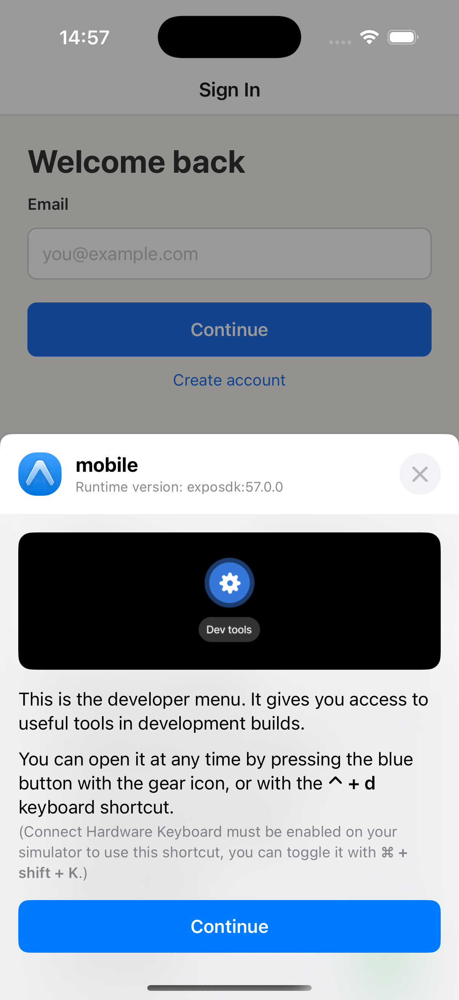
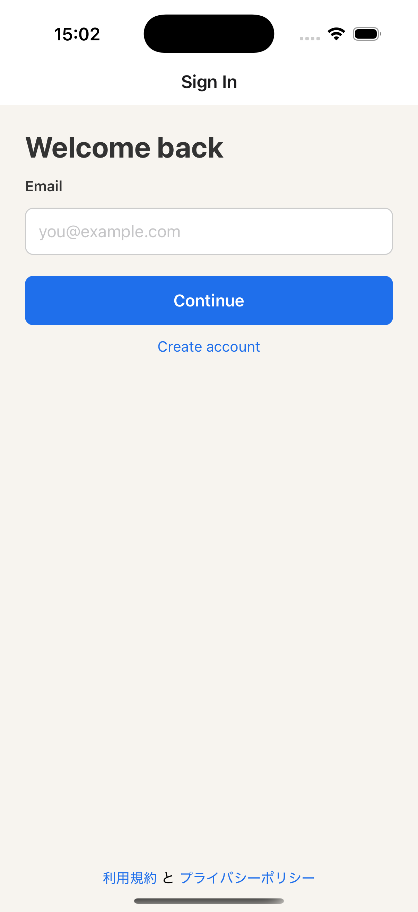
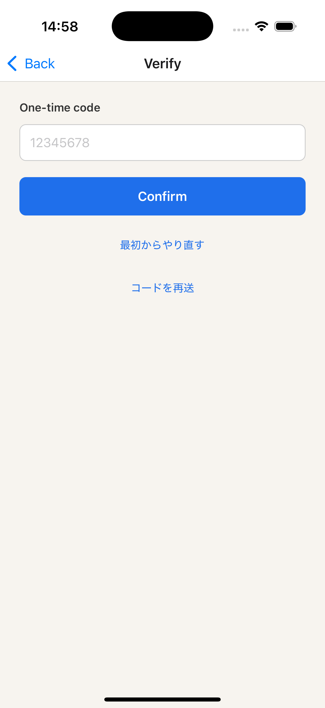
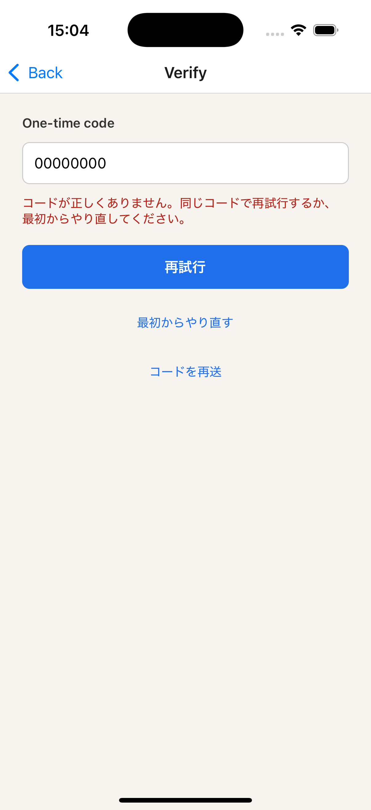

# iOS E2E result

## Executed checks

- API health endpoint returned `200`.
- The iOS development client opened the Sign In screen.
- The Sign In screen displayed validation feedback for an invalid email address.
- The Sign In screen accepted the confirmed E2E Owner email and displayed the eight-digit OTP screen.
- The OTP screen displayed retry and resend actions for an invalid OTP.
- Cognito email OTP confirmation moved the app to the authenticated screen.

## Screenshot attachment

## Result

The iOS E2E completed on an iPhone 16 Pro simulator with the SDK 57 development client. API contract, Cognito OTP, mobile TypeScript verification, and the Sign In interaction flow completed successfully.
