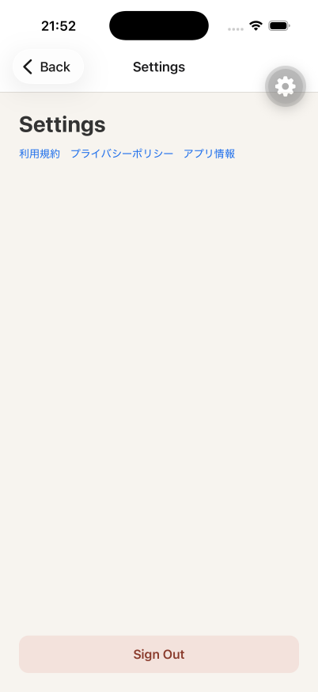
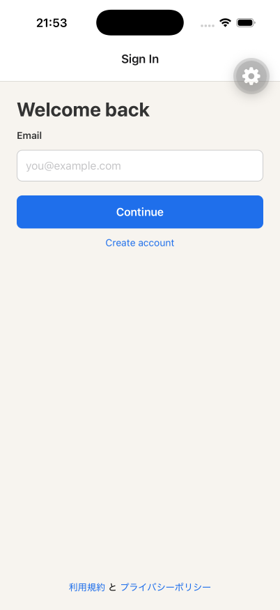

# iOS E2E result

## Executed checks

- API health endpoint returned `200` on `http://127.0.0.1:3000/health`.
- OpenAPI included `POST /v1/auth/sign-out`.
- iPhone 17 Pro simulator (`CCF5A59F-9C25-4F6F-86F1-8AE4BC7339BB`, iOS 26.5) ran the SDK 57 development client against Metro on `8081`.
- Sign In with Cognito email OTP authenticated the Owner and reached Home.
- Home opened Settings (`SETTINGS-01` idle).
- Settings Sign Out called `POST /v1/auth/sign-out` and received `204`.
- After Sign Out the app returned to Sign In (`AUTH-01`).

## Commands

```bash
# API (worktree) with host Postgres
cd apps/api
set -a && source ../.env.local && set +a
export POSTGRES_HOST=127.0.0.1 AWS_PROFILE=walk-dog AWS_REGION=ap-northeast-1
npm run dev

# Metro
cd apps/mobile
npx expo start --clear --port 8081

# Simulator + app drive (agent-device)
xcrun simctl boot CCF5A59F-9C25-4F6F-86F1-8AE4BC7339BB
xcrun simctl install CCF5A59F-9C25-4F6F-86F1-8AE4BC7339BB <Debug-iphonesimulator/mobile.app>
# open com.cacheandbuffer.walkdog → connect Metro → Sign In → OTP → Settings → Sign Out
```

## Screenshot attachment





## Result

The iOS E2E completed on an iPhone 17 Pro simulator with the SDK 57 development client. Settings idle and Sign Out → Sign In were captured. API `POST /v1/auth/sign-out` returned `204` and the mobile session cleared to Sign In.
