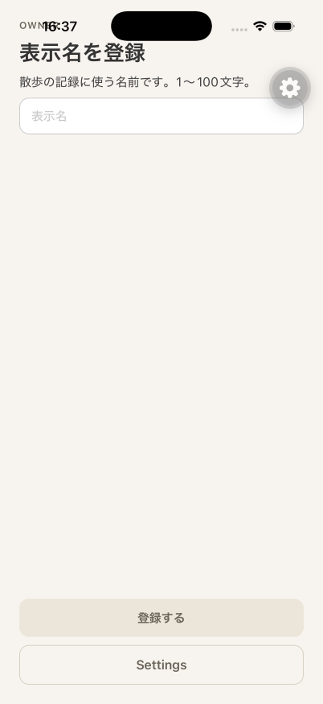
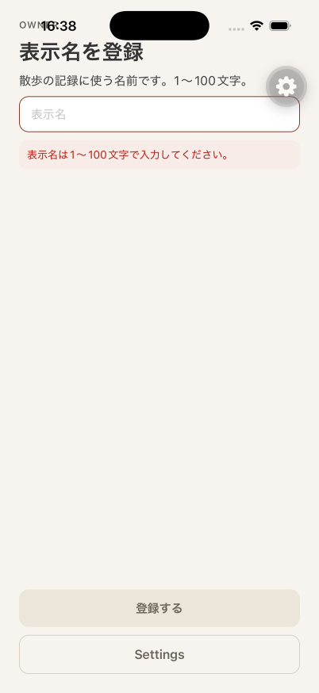
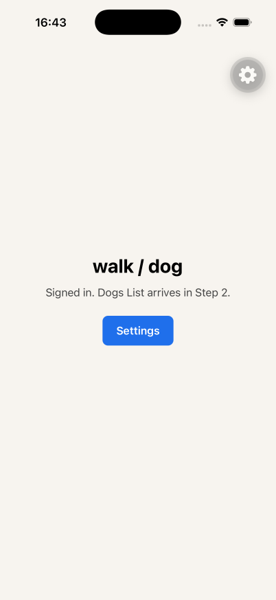

# iOS E2E result

## Executed checks

- API health endpoint returned `200` on `http://127.0.0.1:3000/health`.
- OpenAPI included `GET /v1/owner` and `PATCH /v1/owner`.
- iPhone 17 Pro simulator (`CCF5A59F-9C25-4F6F-86F1-8AE4BC7339BB`, iOS 26.5) ran the SDK 57 development client against Metro on `8081`.
- Sign In with Cognito email OTP authenticated an Owner whose `displayName` was unset.
- `GET /v1/owner` returned `200` and the app showed `/owner/display-name` (`NAME-01` idle).
- Empty submit showed `NAME-04` with `表示名は1〜100文字で入力してください。` and a retryable Register action.
- Valid name `Akira` called `PATCH /v1/owner` and received `200`.
- After registration the app showed authenticated home (`HOME-01`).

## Commands

```bash
# API (worktree) with host Postgres
cd apps/api
set -a && source ../.env.local && set +a
export POSTGRES_HOST=127.0.0.1 AWS_PROFILE=walk-dog AWS_REGION=ap-northeast-1
npm run dev

# Metro
cd apps/mobile
npx expo start --clear --port 8081

# Simulator + app drive (agent-device)
xcrun simctl boot CCF5A59F-9C25-4F6F-86F1-8AE4BC7339BB
xcrun simctl install CCF5A59F-9C25-4F6F-86F1-8AE4BC7339BB <Debug-iphonesimulator/mobile.app>
# open com.cacheandbuffer.walkdog → Sign In → OTP → display-name idle → empty submit → Akira → home
```

## Screenshot attachment







## Result

The iOS E2E completed on an iPhone 17 Pro simulator with the SDK 57 development client. Display-name idle, empty-input validation, and home after `PATCH /v1/owner` `200` were captured.
