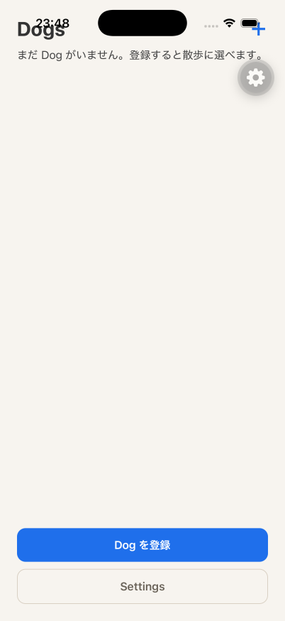
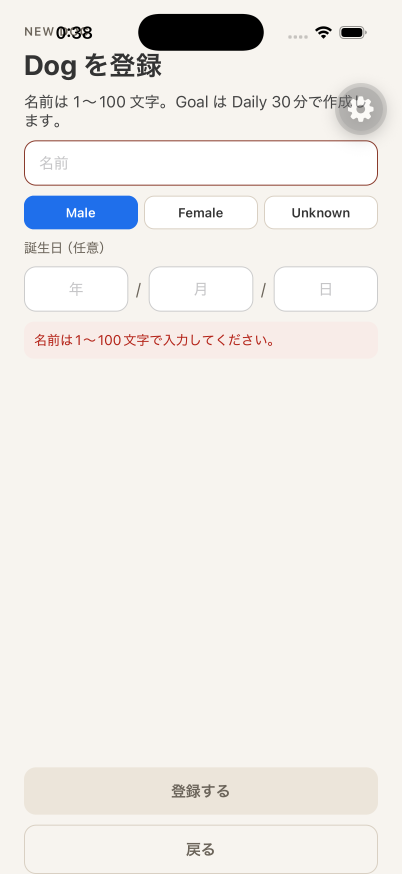
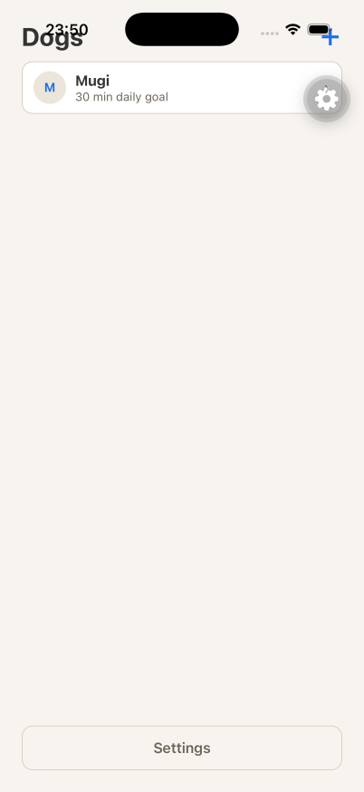
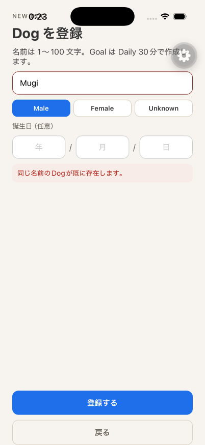
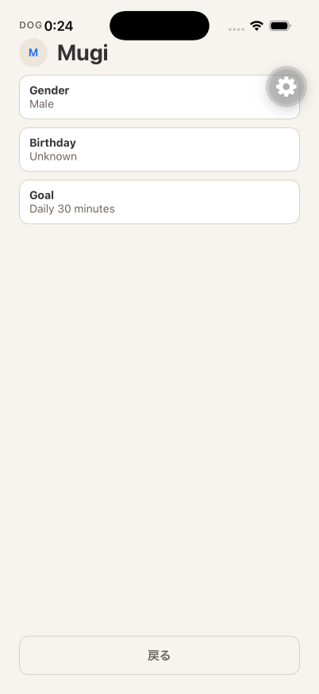

# iOS E2E result

## Executed checks

- `aws sts get-caller-identity --profile walk-dog` succeeded (`arn:aws:sts::967026628831:assumed-role/AWSReservedSSO_walk-dog_5388bc4607b257b0/matsuokashuhei`) before Verify.
- `apps/api` `npm run migrate` applied successfully against host Postgres.
- API health endpoint returned `200` on `http://127.0.0.1:3001/health`.
- OpenAPI included `GET /v1/dogs`, `POST /v1/dogs`, and `GET /v1/dogs/{dogId}`.
- iPhone 17 Pro simulator (`C01CDE0B-DAF2-4466-9C9B-41E63A0CBEDE`, iOS 26.2) ran the SDK 57 development client against Metro on `8082`.
- Sign In with Cognito email OTP authenticated an Owner whose `displayName` was already set.
- Authenticated home showed Dogs Empty (`DOG-01`): `まだ Dog がいません。登録すると散歩に選べます。`
- Register with empty Name and Male selected showed `DOG-03` invalid: red Name field, `名前は1〜100文字で入力してください。` on `dog-new-error`, and a retryable `登録する`. No `POST /v1/dogs` on that tap.
- Valid name `Mugi` + Male called `POST /v1/dogs` and received `201`.
- `currentGoal` was `period: daily`, `minutes: 30`, `effectiveTo: null` (Postgres `goal_revisions` row; list subtitle `30 min daily goal`).
- Registering `Mugi` again called `POST /v1/dogs` and received `409` with `同じ名前のDogが既に存在します。`
- Row tap opened Detail (`GET /v1/dogs/:dogId` `200`) with Goal `Daily 30 minutes`.

## Commands

```bash
# API (worktree) with host Postgres
cd apps/api
set -a && source /Users/matsuokashuhei/Development/github.com/matsuokashuhei/walk-dog/apps/.env.local && set +a
export POSTGRES_HOST=127.0.0.1 AWS_PROFILE=walk-dog AWS_REGION=ap-northeast-1
npm run migrate
# port 3000 was occupied by the prior worktree API (no /v1/dogs); this worktree API listened on 3001
npx tsx --import ./src/instrument.ts /tmp/walkdog-start-api-3001.ts

# Metro
cd apps/mobile
# EXPO_PUBLIC_API_BASE_URL=http://127.0.0.1:3001
npx expo start --clear --port 8082

# Simulator + app drive (agent-device)
xcrun simctl boot C01CDE0B-DAF2-4466-9C9B-41E63A0CBEDE
xcrun simctl install C01CDE0B-DAF2-4466-9C9B-41E63A0CBEDE <Debug-iphonesimulator/mobile.app>
# open com.cacheandbuffer.walkdog → Metro 8082 → Sign In → OTP → Empty → empty Name + Male → 登録する invalid → Mugi + Male 201 List → duplicate 409 → row tap Detail
# recapture: metro reload → /dogs/new → Male + empty Name → 登録する → ios-dog-new-invalid.png
```

API log evidence:

```text
POST /v1/dogs status=201 requestId=c2142ab8-7077-4981-9400-a8d64e5b9037
POST /v1/dogs status=409 requestId=57c31946-30fd-4b12-bfe2-cf130c33d955
GET  /v1/dogs/:dogId status=200 requestId=f265fe51-f18f-411b-b4c8-817f1723ae8f
```

Postgres after `201`:

```text
 name | period | minutes | effective_to
------+--------+---------+--------------
 Mugi | daily  |      30 |
```

## Screenshot attachment











## Result

The iOS E2E completed on an iPhone 17 Pro simulator with the SDK 57 development client. Dogs Empty, register invalid (`名前は1〜100文字で入力してください。` with retryable `登録する`), List after `POST /v1/dogs` `201` with Daily 30 `currentGoal`, duplicate `409`, and Detail were captured.
