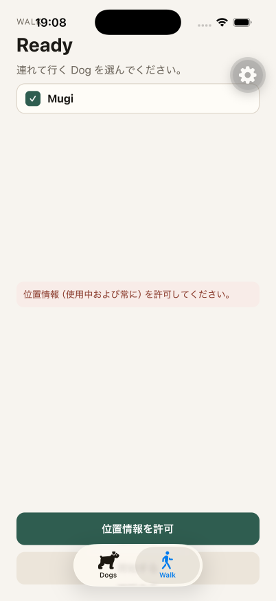
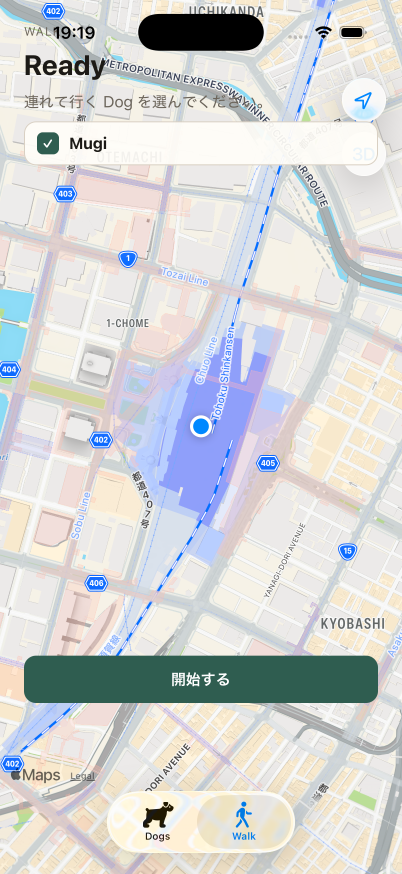
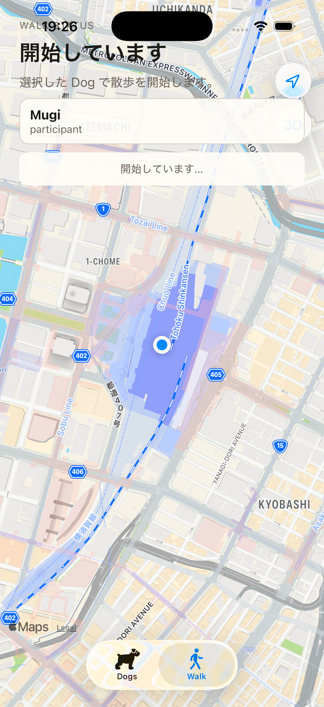
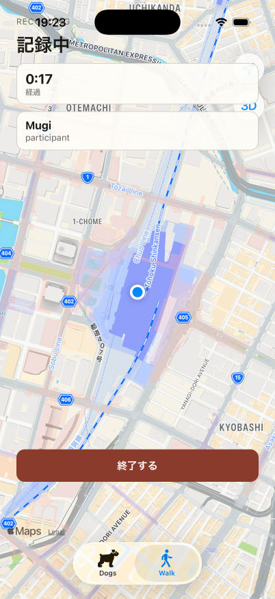
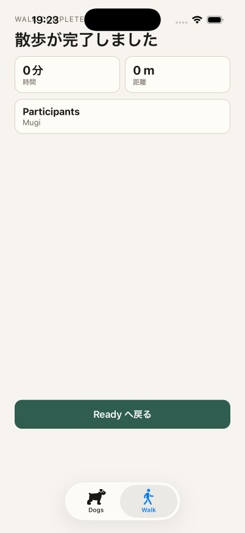
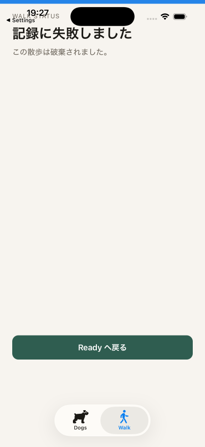
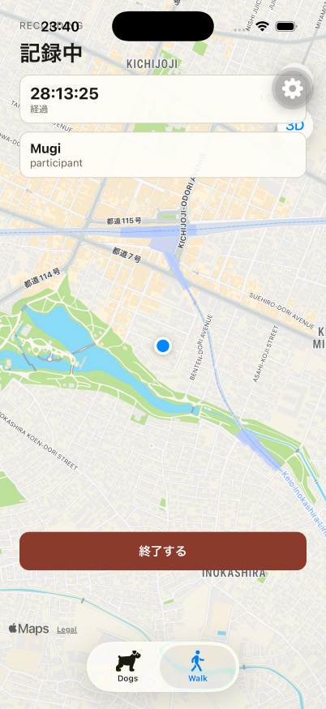
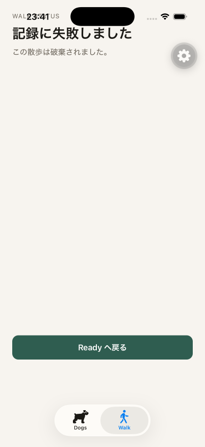

# iOS E2E result

## Executed checks

- `aws sts get-caller-identity --profile walk-dog` succeeded (`arn:aws:sts::967026628831:assumed-role/AWSReservedSSO_walk-dog_5388bc4607b257b0/matsuokashuhei`) before any Verify/OTP step. The session was already signed in from the prior Dog slice (display name set, dog `Mugi` present).
- Worktree API on `http://127.0.0.1:3000` returned `GET /health` `200`. Walks migrations were already applied (`GET /v1/walks/active` returned `204` before the first start).
- iPhone 17 Pro simulator (`C01CDE0B-DAF2-4466-9C9B-41E63A0CBEDE`, iOS 26.2) ran the SDK 57 development client (`expo@57.0.13`, `ExpoModulesCore` 57.0.11, `ExpoLocation` 57.0.10) against Metro on `8081`.
- Native rebuild was required after the launch dyld crash (`Symbol not found: BaseModule.willDestroy` in `ExpoLocation.framework`). Aligning `expo-modules-core` to 57.0.11 and reinstalling pods removed the crash; the app stayed in the foreground on Dogs with tabs Dogs / Walk.
- Walk tab with `Mugi` selected and location unset showed `位置情報（使用中および常に）を許可してください。` and `位置情報を許可`.
- After `simctl privacy grant location` + `location-always`, Apple MapKit showed the current-location puck and enabled `開始する`.
- `POST /v1/walks` returned `201`. The in-flight Starting screen showed `開始しています` / `開始しています…` with participant `Mugi`.
- Recording showed `記録中`, elapsed timer, participant `Mugi`, and `終了する`.
- `POST /v1/walks/:walkId/finish` returned `200`. Completed showed `散歩が完了しました`, `0 m` distance, and `Ready へ戻る`.
- A later Recording session had location revoked (`simctl privacy revoke location` / `location-always`), then the app was backgrounded via Settings and foregrounded. Walk showed Failed: `記録に失敗しました` / `この散歩は破棄されました。` That capture (`ios-walk-failed.png`) was taken before `DELETE /v1/walks/:walkId` existed, so the API walk stayed `recording`.

## DELETE /v1/walks/:walkId

- `aws sts get-caller-identity --profile walk-dog` succeeded with the same assumed-role ARN before Sign In Verify/OTP.
- Worktree API `GET /health` returned `200`. Metro on `8081` served the worktree development client.
- Sign In used Cognito email OTP. After Verify, Dogs listed `Mugi`.
- Walk tab restored the leftover Recording walk from the prior slice: `GET /v1/walks/active` `200` (`requestId=ea0628e5-4562-4922-95cb-0ea08cfc6bdf`). The screen showed `記録中`, participant `Mugi`, and `終了する`.
- `simctl privacy revoke location` and `location-always`, then Dogs tab then Walk tab ran `verifyRecording`.
- `DELETE /v1/walks/:walkId` returned `204` (`requestId=8d27fb8e-1dee-4845-819f-93de66a0aa72`).
- Failed showed `記録に失敗しました` / `この散歩は破棄されました。` with retryable `Ready へ戻る`.

## Commands

```bash
# API (worktree) with host Postgres — already running
cd apps/api
set -a && source /Users/matsuokashuhei/Development/github.com/matsuokashuhei/walk-dog/apps/.env.local && set +a
export POSTGRES_HOST=127.0.0.1 AWS_PROFILE=walk-dog AWS_REGION=ap-northeast-1
npm run dev
# GET /health 200 on http://127.0.0.1:3000

# Native rebuild after ExpoLocation / ExpoModulesCore ABI align
cd apps/mobile
export EXPO_PUBLIC_API_BASE_URL=http://127.0.0.1:3000
npx expo run:ios --device C01CDE0B-DAF2-4466-9C9B-41E63A0CBEDE

# Metro (after rebuild)
env -u CI npx expo start --port 8081 --dev-client

# Simulator + app drive (agent-device)
xcrun simctl boot C01CDE0B-DAF2-4466-9C9B-41E63A0CBEDE
# open com.cacheandbuffer.walkdog → Walk tab
# select Mugi (location unset) → ios-walk-ready-location.png
# grant location + location-always → map puck + 開始する → ios-walk-startable.png
# 開始する → Starting → ios-walk-starting.png → Recording → ios-walk-recording.png
# 終了する → Completed 0 m → ios-walk-completed.png
# start again → revoke location → background Settings → foreground → Failed → ios-walk-failed.png

# DELETE use case (second iPhone 17 Pro A858B985-59B6-4699-A9AE-2C69CA06C2CA)
xcrun simctl boot A858B985-59B6-4699-A9AE-2C69CA06C2CA
xcrun simctl erase A858B985-59B6-4699-A9AE-2C69CA06C2CA
xcrun simctl install A858B985-59B6-4699-A9AE-2C69CA06C2CA <Debug-iphonesimulator/mobile.app>
# open com.cacheandbuffer.walkdog --udid A858B985… --metro-port 8081
# Sign In → OTP Verify → Dogs (Mugi) → Walk
# GET /v1/walks/active 200 Recording → ios-walk-delete-recording.png
# simctl privacy revoke location + location-always
# Dogs tab → Walk tab → DELETE /v1/walks/:walkId 204 → ios-walk-delete-failed.png
```

API log evidence:

```text
POST /v1/walks status=201 requestId=8a0c91dc-b84d-4df9-a0fb-106e40e554f7
POST /v1/walks/:walkId/finish status=200 requestId=3802276b-e3fb-4096-a74e-2d2b3ca7735c
POST /v1/walks status=201 requestId=9c284bdc-d686-4430-a5cc-f64af0ff1563
POST /v1/walks/:walkId/finish status=200 requestId=93ae164f-873f-4bf6-b643-4168cc0d6ce5
POST /v1/walks status=201 requestId=c4d379f4-4ed4-424a-a7a8-a59b67d88bad
GET  /v1/walks/active status=200 requestId=ea0628e5-4562-4922-95cb-0ea08cfc6bdf
DELETE /v1/walks/:walkId status=204 requestId=8d27fb8e-1dee-4845-819f-93de66a0aa72
```

The last `POST 201` (`c4d379f4-…`) is the Recording walk restored by `GET /v1/walks/active` `200` and discarded by `DELETE` `204`. Completed evidence uses the finish `200` rows above; the Completed PNG shows `0 m`.

## Screenshot attachment

















## Result

The iOS E2E completed on an iPhone 17 Pro simulator with the SDK 57 development client. Location-required validation (`位置情報（使用中および常に）を許可してください。`), startable map with current-location puck, Starting, Recording, Completed (`0 m` after `POST .../finish` `200`), and Failed after location revoke were captured.

The DELETE use case restored Recording via `GET /v1/walks/active` `200`, revoked foreground and background location, then discarded the walk with `DELETE /v1/walks/:walkId` `204`. Failed showed `記録に失敗しました` / `この散歩は破棄されました。` with `Ready へ戻る`.
