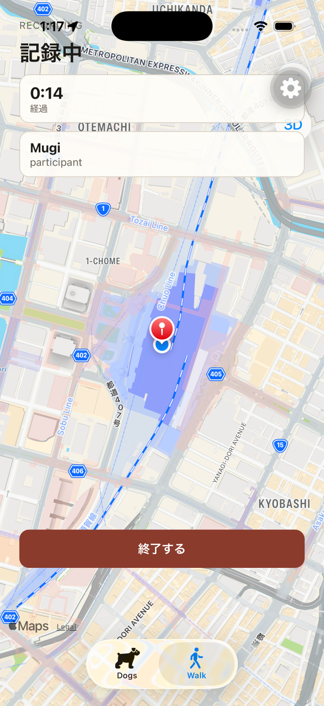
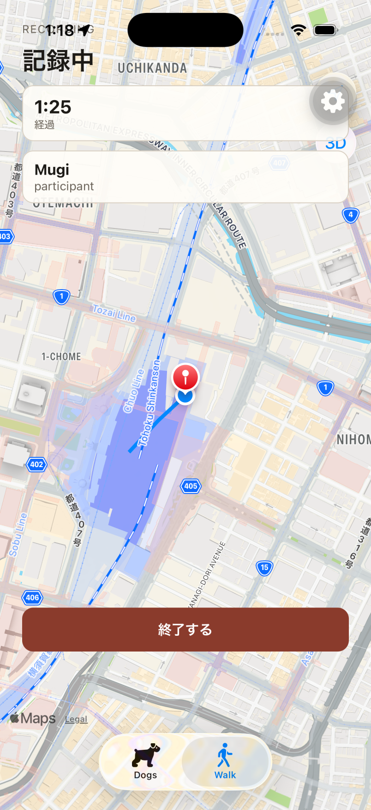
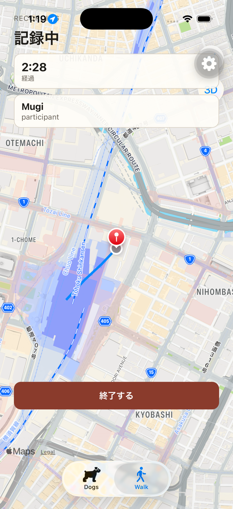

# iOS E2E result

## Executed checks

- `aws sts get-caller-identity --profile walk-dog` succeeded (`arn:aws:sts::967026628831:assumed-role/AWSReservedSSO_walk-dog_5388bc4607b257b0/matsuokashuhei`) before Verify/OTP.
- Compose in `apps/` was already up (postgres, elasticmq, dynamodb, api, worker). `GET http://127.0.0.1:3000/health` returned `200` `{"status":"ok"}` (`requestId=43b8c1e1-100b-4ae0-8b62-a596f2fbfc75`).
- iPhone 17 Pro simulator (`C01CDE0B-DAF2-4466-9C9B-41E63A0CBEDE`, iOS 26.2) ran the SDK 57 development client (`expo@57.0.14`, bundle id `com.cacheandbuffer.walkdog`) against Metro on `8081` with `EXPO_PUBLIC_API_BASE_URL=http://127.0.0.1:3000`. Native rebuild was not required.
- Sign In with Cognito email OTP authenticated the Owner. Dogs listed `Mugi`.
- Walk Ready showed Apple MapKit (Uchikanda / Otemachi / Kyobashi) after `simctl privacy grant location` + `location-always` and `simctl location set 35.681236,139.767125`. Mugi selected enabled `開始する`.
- `POST /v1/walks` returned `201` (`requestId=b1e4bb98-20d0-496d-be4e-b076a3cbdea3`). Recording showed `記録中`, elapsed timer, participant `Mugi`, MapKit background, and a current-location pin.
- The first `POST /v1/walks/:walkId/track-points` returned `201` at start (`requestId=56f37e22-bd58-4508-8129-ddf83024bea6`). Further samples every ~10s also returned `201`.
- After moving the simulator toward `35.6820,139.7680` then `35.6826,139.7688` with ≥10s between changes, Recording showed a polyline of device-held TrackPoints in `recordedAt` order.
- Home backgrounded the app. Sampling continued (`POST .../track-points` `201` at `16:19:17Z` while on Home). Foreground restored Recording with MapKit, pin, and path still present (`GET /v1/walks/active` `200`, `requestId=91559f77-7716-401a-8a63-6a4c19daf8ba`).
- TrackPoint has no dedicated input-error or retryable-failure screen. Ready location-permission copy was not captured. Finish was not run in this slice; Completed is out of scope and distance remaining `0` is expected.

## Commands

```bash
# SSO (docker without -ti; interactive `aws` is aliased to docker -ti)
docker run --rm -v "$HOME/.aws:/root/.aws" amazon/aws-cli sts get-caller-identity --profile walk-dog

# Compose already up in apps/; health
curl -sS -i http://127.0.0.1:3000/health
# GET /health 200 {"status":"ok"}

# Simulator + location
UDID=C01CDE0B-DAF2-4466-9C9B-41E63A0CBEDE
xcrun simctl privacy "$UDID" grant location com.cacheandbuffer.walkdog
xcrun simctl privacy "$UDID" grant location-always com.cacheandbuffer.walkdog
xcrun simctl location "$UDID" set 35.681236,139.767125

# Metro already on 8081 (worktree apps/mobile, EXPO_PUBLIC_API_BASE_URL=http://127.0.0.1:3000)

# Drive (agent-device 0.20.8)
AD=/tmp/agent-device-cli/node_modules/.bin/agent-device
$AD open com.cacheandbuffer.walkdog --foreground --platform ios --udid "$UDID" --metro-port 8081
# Verify → OTP Confirm → Dogs (Mugi) → Walk → select Mugi → 開始する → Recording
# screenshot ios-walk-recording-map.png
xcrun simctl location "$UDID" set 35.6820,139.7680
# wait ≥10s
xcrun simctl location "$UDID" set 35.6826,139.7688
# wait ≥10s → screenshot ios-walk-recording-path.png
$AD home
# wait (background samples continued) then foreground
$AD open com.cacheandbuffer.walkdog --foreground --platform ios --udid "$UDID"
# screenshot ios-walk-recording-background-return.png
```

API log evidence:

```text
GET  /health status=200 requestId=43b8c1e1-100b-4ae0-8b62-a596f2fbfc75
GET  /v1/walks/active status=204 requestId=de00f14a-ace0-492a-9424-804dd327dde3
POST /v1/walks status=201 requestId=b1e4bb98-20d0-496d-be4e-b076a3cbdea3
POST /v1/walks/:walkId/track-points status=201 requestId=56f37e22-bd58-4508-8129-ddf83024bea6
POST /v1/walks/:walkId/track-points status=201 requestId=76a73e97-523c-419f-b7b9-d0ecb9d13192
POST /v1/walks/:walkId/track-points status=201 requestId=d36849be-eecb-4d46-b9f1-7e7cc4dd3ae2
POST /v1/walks/:walkId/track-points status=201 requestId=260ba3d4-c74f-4d25-96a3-de710dc60058
POST /v1/walks/:walkId/track-points status=201 requestId=835bdef6-8c98-4e34-95f2-b8e11ac4e097
POST /v1/walks/:walkId/track-points status=201 requestId=86d92693-34e9-4a81-a428-fbdeefbfdaa2
POST /v1/walks/:walkId/track-points status=201 requestId=0f697448-aa62-4420-a987-d99444c8cb11
POST /v1/walks/:walkId/track-points status=201 requestId=5424912c-12ed-4dfd-a68d-ea2c120e2c85
POST /v1/walks/:walkId/track-points status=201 requestId=9ca5d26d-315f-4272-83d6-e6109dd36dc1
POST /v1/walks/:walkId/track-points status=201 requestId=fa514d62-9626-469a-b48c-c2281b1e90da
POST /v1/walks/:walkId/track-points status=201 requestId=4f54371d-438a-436e-89bd-7fe325996d2a
GET  /v1/walks/active status=200 requestId=91559f77-7716-401a-8a63-6a4c19daf8ba
POST /v1/walks/:walkId/track-points status=201 requestId=d3b95410-6027-47a8-9801-1af720d2fb2a
POST /v1/walks/:walkId/track-points status=201 requestId=86bd7a88-5abd-422e-8624-a3e7b6719065
```

The `16:19:17Z` track-point `201` (`4f54371d-…`) landed while the app was on Home. Foreground then restored Recording via `GET /v1/walks/active` `200`.

## Screenshot attachment







## Result

The iOS E2E completed on an iPhone 17 Pro simulator with the SDK 57 development client. Recording showed Apple MapKit, a current-location pin, and a polyline of local TrackPoints. `POST /v1/walks/:walkId/track-points` returned `201`. After Home then return, Recording still showed map, pin, and path, and background samples continued to `201`.
