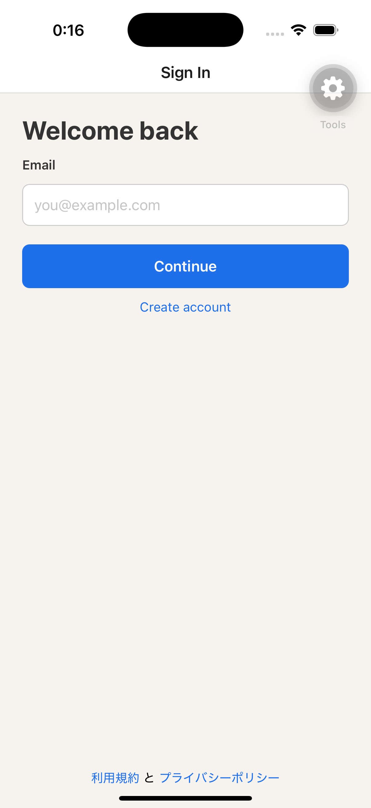

# iOS E2E result

## Authentication expiry

An iPhone 16 Pro simulator (iOS 18.3) ran the SDK 57.0.15 development client against the local API at `http://127.0.0.1:3000`.

The development build restored a test-only expired session with an access token, ID token, and refresh token. At `2026-08-22T15:16:32.212Z`, immediately after the Simulator app launch, the local API recorded `GET /v1/owner` as `401` with request ID `cf5b64b7-6707-4ca0-9cd3-6ceea337f0b3`. The app displayed the Sign In screen after that request. The test-only fixture was removed before committing.



The API request record is saved in [api-log.ndjson](api-log.ndjson). The API contract for a Bearer token that requires a new login is recorded in [api-response-unauthenticated.http](api-response-unauthenticated.http): it returns `401` with `code: "UNAUTHENTICATED"`.

## Commands

```sh
npx expo install --check
npx expo-doctor
npx expo prebuild --clean
EXPO_PUBLIC_API_BASE_URL=http://127.0.0.1:3000 npx expo run:ios --device 'iPhone 16 Pro' --port 8082
curl --include --header 'Authorization: Bearer expired-token' http://127.0.0.1:3000/v1/owner
```

`expo install --check` reported compatible dependencies, `expo-doctor` completed 21 of 21 checks, and the API returned `401` with `code: "UNAUTHENTICATED"` for the invalid Bearer token.
