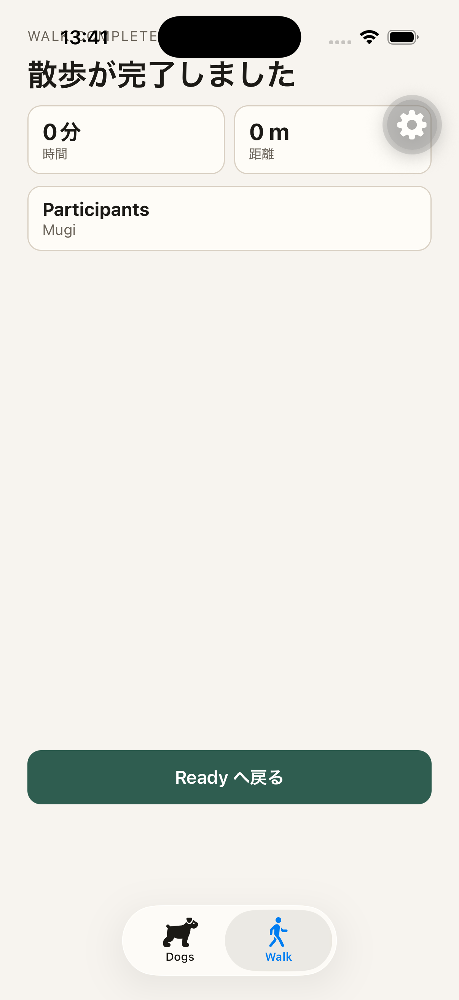
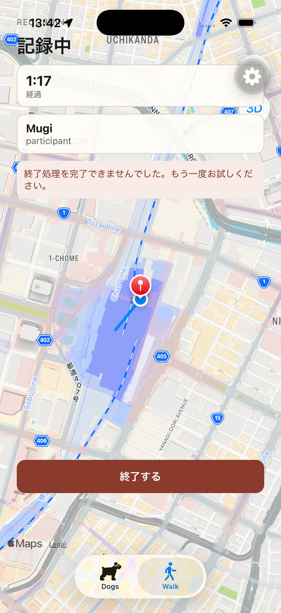

# R1 Step 5 Finish — iOS E2E

Finish success, retryable failure, and recovery passed in A → B → C order on 2026-09-06. The iOS UI drove the real API, PostgreSQL, ElasticMQ, worker, DynamoDB Local, and Cognito stack. B and C used the same walk and Finish Idempotency-Key.

## Environment

| Item | Observed value |
| --- | --- |
| Checkout | `/Users/matsuokashuhei/Development/github.com/matsuokashuhei/walk-dog/.worktrees/agent/r1-step5-finish-20260906122123` |
| Branch / tested commit | `agent/r1-step5-finish-20260906122123` / `b23d90b6bb76c370e8892ab2bb2715a2287cee6e` |
| Simulator | iPhone 17 Pro, iOS 26.2, `C01CDE0B-DAF2-4466-9C9B-41E63A0CBEDE` |
| App | Existing development client, `com.cacheandbuffer.walkdog` |
| Metro | This checkout’s `apps/mobile`, port 8081, API base `http://127.0.0.1:3000` |
| API | `/health` 200 before scenarios and after C; API and worker rebuilt from this checkout with Compose project `apps` |
| AWS SSO | `sts get-caller-identity --profile walk-dog` succeeded using `amazon/aws-cli` with the existing AWS session, before OTP verification |
| Authentication | Cognito OTP fetched with the repository helper; `/v1/auth/sign-in/verify` 200 at 04:35:58 UTC |
| Dog / location | Mugi; location-always granted; samples at `35.681236,139.767125` and `35.682236,139.768125` |
| Evidence tools | XcodeBuildMCP UI snapshots/taps, `simctl` PNG capture, React Native CDP network events and response bodies, API logs, DynamoDB Query |
| Final stack state | API, worker, ElasticMQ, DynamoDB Local, and PostgreSQL running; PostgreSQL healthy |

## Scenario results

All timestamps below are UTC.

| Scenario | UI evidence | API / data evidence | Result |
| --- | --- | --- | --- |
| A — Finish with TrackPoints | Selected Mugi, started fresh Recording, tapped `walk-finish`; `walk-completed` showed `散歩が完了しました`, `0 m`, and `Ready へ戻る`. | Walk `01a07504-de79-70ff-bed6-8a1f20772cfe`; TrackPoint 201 at 04:40:48.581; Finish 200 at 04:40:56.946, `state=completed`, `distanceMeters=0`, duration 8 seconds. DynamoDB Query returned one point matching recordedAt `2026-09-06T04:40:48.552Z`, trackPointId `01a07504-debe-776e-b015-39f4da049296`. | passed |
| B — Worker stopped | Started a fresh Recording with Mugi and an accepted point; stopped worker, accepted additional samples, tapped Finish. Recording retained with `walk-finish` available and `walk-finish-error` showing `終了処理を完了できませんでした。もう一度お試しください。`. | Walk `01a07505-7d31-7788-ad3d-a89cddfe6219`; initial TrackPoint 201 at 04:41:29.197; additional 201 at 04:41:39.218 and 04:41:49.250. Worker was `exited`; DynamoDB Query then returned only the initial point. Finish 503 at 04:42:36.153 with `SERVICE_UNAVAILABLE`, `retryable=true`, exact UI message. GET active 200 at 04:42:59.971 returned this walk in `recording`. | passed |
| C — Restart worker and retry | Returned from Dogs to Walk to observe active state, restarted worker, tapped the same Finish retry; `walk-completed`, `散歩が完了しました`, `0 m`, and `Ready へ戻る` visible. | Same walk; Finish 200 at 04:43:07.348 with `state=completed`, `distanceMeters=0`, duration 98 seconds. B and C both sent Idempotency-Key `1788669726029-7a6c20fce1f34`. | passed |

B deliberately accepted further samples after stopping the worker. This established pending confirmation before Finish while preserving the brief’s initial accepted-point step.

## Commands and operations

Commands ran from the checkout above, with Metro run from its `apps/mobile` directory.

```sh
git status --short
git branch --show-current
xcrun simctl list devices booted
docker run --rm -v "$HOME/.aws:/root/.aws" amazon/aws-cli sts get-caller-identity --profile walk-dog
docker compose -f apps/compose.yml up -d --build api worker
curl -s -o /dev/null -w '%{http_code}\n' http://127.0.0.1:3000/health
# apps/mobile:
EXPO_PUBLIC_API_BASE_URL=http://127.0.0.1:3000 REACT_NATIVE_PACKAGER_HOSTNAME=127.0.0.1 npm start -- --lan --port 8081
# checkout root:
xcrun simctl openurl booted 'exp+walk-dog://expo-development-client/?url=http%3A%2F%2Flocalhost%3A8081'
E2E_EMAIL=<existing-test-owner-email> bash apps/mobile/scripts/e2e/fetch-cognito-otp.sh
xcrun simctl privacy booted grant location-always com.cacheandbuffer.walkdog
xcrun simctl location booted set 35.681236,139.767125
docker compose -f apps/compose.yml stop worker
xcrun simctl location booted set 35.682236,139.768125
docker inspect apps-worker-1 --format '{{.State.Status}}'
docker compose -f apps/compose.yml start worker
docker logs apps-api-1 --since 2026-09-06T04:40:00Z
docker compose -f apps/compose.yml ps
```

XcodeBuildMCP `snapshot_ui`, `type_text`, and `tap` drove sign-in, verification, Dog selection, Start, Finish, tab navigation, and retry. CDP `Network.enable`, `Network.requestWillBeSent`, `Network.responseReceived`, and `Network.getResponseBody` observed the app’s requests; the debugger used origin `http://127.0.0.1:8081`. DynamoDB was queried inside the API container using `@aws-sdk/client-dynamodb`, `QueryCommand`, table `TrackPoints`, and `walkId = :w` for each scenario’s walk.

Each required state was captured immediately using:

```sh
xcrun simctl io booted screenshot docs/logs/20260906122123-r1-step5-finish/screenshots/ios-walk-finish-completed.png
xcrun simctl io booted screenshot docs/logs/20260906122123-r1-step5-finish/screenshots/ios-walk-finish-retry.png
xcrun simctl io booted screenshot docs/logs/20260906122123-r1-step5-finish/screenshots/ios-walk-finish-retry-completed.png
```

## Setup observations

The worktree’s local Compose environment was reconstructed from the running API container’s environment into ignored `apps/.env.local`, then API and worker were built from this checkout. Metro initially bound IPv6 localhost; restarting with `--lan` and `REACT_NATIVE_PACKAGER_HOSTNAME=127.0.0.1` made its advertised IPv4 bundle URL reachable.

The account initially resumed an older recording (`01a01acf-d892-745d-a6f5-f016ddab2b9f`, 3,343 PostgreSQL points when inspected). Its Finish returned 503 with the worker running. Before A, location permission was revoked and the app foregrounded to invoke its existing failed-walk transition: DELETE returned 204 at 04:40:03.052. Permission was then granted and the development client relaunched. This setup produced a development error overlay for denied location permission; relaunch restored the normal Dogs screen. A and B both started fresh walks afterward.

The screenshots show the development client’s floating gear and status-bar overlap on the small English eyebrow. The required Japanese completion titles, distance, retry message, and action buttons are readable. All three original PNGs were visually inspected.

## Captured responses

### POST /v1/walks/01a07504-de79-70ff-bed6-8a1f20772cfe/finish — 200

Observed at `2026-09-06T04:40:56.946Z`. Idempotency-Key: `1788669656911-140ebdc62c232e`.

```json
{
  "requestId": "5ad74cb7-a730-4118-8396-1cfac71b850c",
  "walkId": "01a07504-de79-70ff-bed6-8a1f20772cfe",
  "ownerId": "019fefb9-87c8-70ae-ba7e-47cb0f4c323f",
  "state": "completed",
  "startedAt": "2026-09-06T04:40:48.504Z",
  "completedAt": "2026-09-06T04:40:56.940Z",
  "durationSeconds": 8,
  "distanceMeters": 0,
  "paceSecondsPerMeter": null,
  "participants": [
    {
      "walkParticipantId": "01a07504-de79-70ff-bed6-8c87522b97b0",
      "dogId": "01a000c0-22af-72ee-a3a9-32ee56c7dc00",
      "name": "Mugi"
    }
  ]
}
```

### POST /v1/walks/01a07505-7d31-7788-ad3d-a89cddfe6219/finish — 503

Observed at `2026-09-06T04:42:36.153Z`. Idempotency-Key: `1788669726029-7a6c20fce1f34`.

```json
{
  "code": "SERVICE_UNAVAILABLE",
  "message": "終了処理を完了できませんでした。もう一度お試しください。",
  "requestId": "7b4a78b9-fdbf-453d-9ed9-704ea050c6e6",
  "retryable": true
}
```

### GET /v1/walks/active — 200

Observed at `2026-09-06T04:42:59.971Z`.

```json
{
  "requestId": "a78d131e-3efc-4937-b49d-a1cce8b25836",
  "walkId": "01a07505-7d31-7788-ad3d-a89cddfe6219",
  "ownerId": "019fefb9-87c8-70ae-ba7e-47cb0f4c323f",
  "state": "recording",
  "startedAt": "2026-09-06T04:41:29.137Z",
  "completedAt": null,
  "participants": [
    {
      "walkParticipantId": "01a07505-7d31-7788-ad3d-afa8c48c0062",
      "dogId": "01a000c0-22af-72ee-a3a9-32ee56c7dc00",
      "name": "Mugi"
    }
  ]
}
```

### POST /v1/walks/01a07505-7d31-7788-ad3d-a89cddfe6219/finish — 200

Observed at `2026-09-06T04:43:07.348Z`. Idempotency-Key: `1788669726029-7a6c20fce1f34`.

```json
{
  "requestId": "d04511f9-59c4-4b4d-8b7b-57071b0eee3a",
  "walkId": "01a07505-7d31-7788-ad3d-a89cddfe6219",
  "ownerId": "019fefb9-87c8-70ae-ba7e-47cb0f4c323f",
  "state": "completed",
  "startedAt": "2026-09-06T04:41:29.137Z",
  "completedAt": "2026-09-06T04:43:07.343Z",
  "durationSeconds": 98,
  "distanceMeters": 0,
  "paceSecondsPerMeter": null,
  "participants": [
    {
      "walkParticipantId": "01a07505-7d31-7788-ad3d-afa8c48c0062",
      "dogId": "01a000c0-22af-72ee-a3a9-32ee56c7dc00",
      "name": "Mugi"
    }
  ]
}
```

## API Finish log evidence

```jsonl
{"level": 30, "time": "2026-09-06T04:40:56.942Z", "service": "api", "environment": "development", "release": "local", "requestId": "5ad74cb7-a730-4118-8396-1cfac71b850c", "method": "POST", "route": "/v1/walks/:walkId/finish", "status": 200, "duration": 17}
{"level": 30, "time": "2026-09-06T04:42:36.148Z", "service": "api", "environment": "development", "release": "local", "requestId": "7b4a78b9-fdbf-453d-9ed9-704ea050c6e6", "method": "POST", "route": "/v1/walks/:walkId/finish", "status": 503, "duration": 30105}
{"level": 30, "time": "2026-09-06T04:43:07.346Z", "service": "api", "environment": "development", "release": "local", "requestId": "d04511f9-59c4-4b4d-8b7b-57071b0eee3a", "method": "POST", "route": "/v1/walks/:walkId/finish", "status": 200, "duration": 17}
```

## Screenshots






## Blockers

All required scenarios and captures completed.
