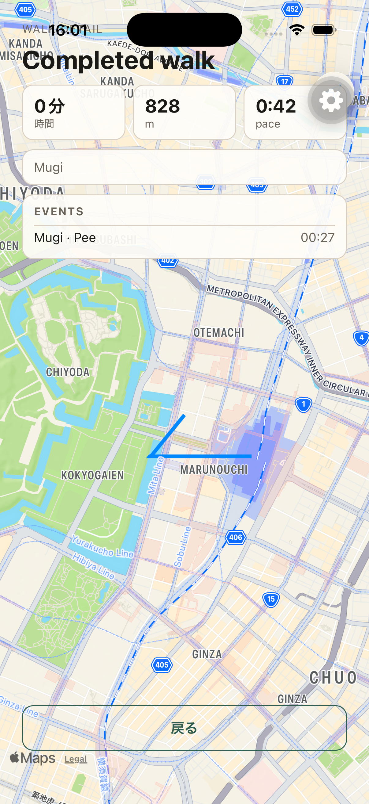
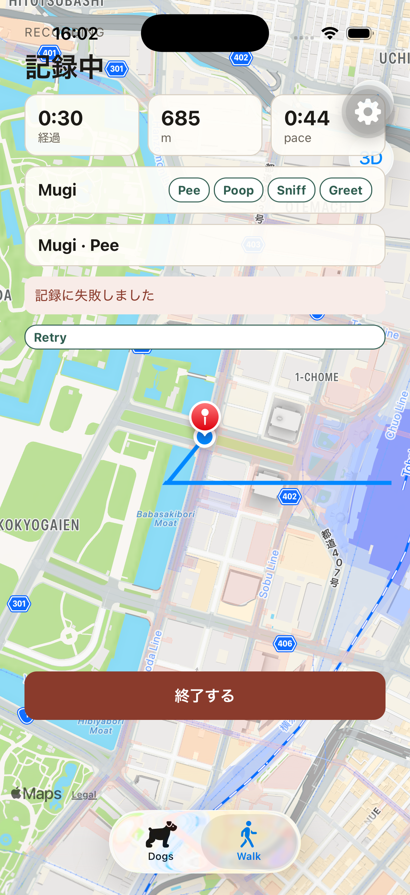
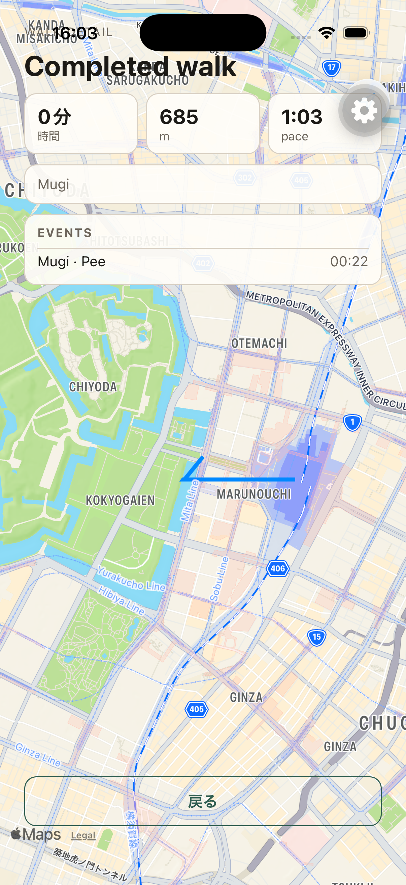

# R1 Step 6 Event + Detail — iOS E2E

Event success, retryable failure, and recovery passed in A → B → C order on 2026-09-06. The iOS UI drove the real API, PostgreSQL, ElasticMQ, worker, DynamoDB Local, and Cognito stack. B and C shared one Recording; Retry reused the same failed Pee Event payload.

## Environment

| Item | Observed value |
| --- | --- |
| Checkout | `/Users/matsuokashuhei/Development/github.com/matsuokashuhei/walk-dog/.worktrees/agent/r1-step6-event-detail-20260906142148` |
| Branch / tested commit | `agent/r1-step6-event-detail-20260906142148` / `a72a44e` (+ local `createClientUuid` fix for Hermes missing `crypto.randomUUID`) |
| Simulator | iPhone 17 Pro, iOS 26.2, `C01CDE0B-DAF2-4466-9C9B-41E63A0CBEDE` |
| App | Existing development client, `com.cacheandbuffer.walkdog` |
| Metro | This checkout’s `apps/mobile`, port 8081, API base `http://127.0.0.1:3000` |
| API | `/health` 200 before A and after C restart; API and worker rebuilt from this checkout with Compose project `apps` |
| AWS SSO | `sts get-caller-identity --profile walk-dog` succeeded via `amazon/aws-cli` before the session (existing Cognito session; no OTP Verify required after Metro reload) |
| Authentication | Existing signed-in session after Expo reload; display name re-registered; Dog `Mugi` (`01a07580-41f1-71b8-8a66-5c6a18e7becc`) registered |
| Dog / location | Mugi; location-always granted; samples around `35.681236,139.767125` with moved points |
| Evidence tools | XcodeBuildMCP UI snapshots/taps, `simctl` PNG capture, API access logs, PostgreSQL `walks` / `walk_events` |
| Final stack state | API, worker, ElasticMQ, DynamoDB Local, and PostgreSQL running; PostgreSQL healthy |

## Scenario results

All timestamps below are UTC.

| Scenario | UI evidence | API / data evidence | Result |
| --- | --- | --- | --- |
| A — Event → Finish → Detail | Selected Mugi, Recording with Event chips, Pee accepted (no error banner), Finish → `walk-completed` with `828` m and `Walk Detail を見る`; Detail `walk-detail` showed `Mugi · Pee` (`walk-detail-event-1f3641fc-2bd9-459c-9a09-bcda2a1e5cf4`). | Walk `01a07584-bbfe-73fa-aa20-8fcf6b3e4d6a`; TrackPoint 201s from 07:00:28; Event POST **201** at 07:00:56.239 (`requestId` `a64a7785-536e-4ec8-828f-416b0d63382f`); Finish **200** at 07:01:04.148, `distance_meters=828`. PostgreSQL event `1f3641fc-2bd9-459c-9a09-bcda2a1e5cf4` type `pee`. | passed |
| B — API stopped → Event error | Fresh Recording with accepted TrackPoints and distance `685` m; stopped API; tapped Pee. Recording retained with `walk-event-error` text **`記録に失敗しました`** and `walk-event-retry` available; failed row `Mugi · Pee` visible. | Walk `01a07586-37ec-73ca-8c29-b0e26e4090a5` started 07:02:05.550; TrackPoint 201s before stop; `/health` unreachable while API stopped; no Event 201 until C. | passed |
| C — Restart API → Retry → Detail | Restarted API to `/health` 200; tapped Retry; error banner cleared; Finish → Completed `685` m; Detail showed `Mugi · Pee` (`walk-detail-event-04f8e046-48cc-4b73-aa1b-99966dbb1002`). | Same walk; Event POST **201** at 07:02:40.400 (`requestId` `1c9549bf-ca99-4123-83a1-2f69f7c849d0`); Finish **200** at 07:02:49.016, `distance_meters=685`. PostgreSQL event `04f8e046-48cc-4b73-aa1b-99966dbb1002` type `pee`. | passed |

## Commands and operations

Commands ran from the checkout above, with Metro run from its `apps/mobile` directory.

```sh
git status --short
git branch --show-current
xcrun simctl list devices booted
docker run --rm -v "$HOME/.aws:/root/.aws" amazon/aws-cli sts get-caller-identity --profile walk-dog
docker compose -f apps/compose.yml up -d --build api worker
curl -s -o /dev/null -w '%{http_code}\n' http://127.0.0.1:3000/health
# apps/mobile:
EXPO_PUBLIC_API_BASE_URL=http://127.0.0.1:3000 REACT_NATIVE_PACKAGER_HOSTNAME=127.0.0.1 npx expo start --lan --port 8081
# checkout root:
xcrun simctl openurl C01CDE0B-DAF2-4466-9C9B-41E63A0CBEDE 'exp+walk-dog://expo-development-client/?url=http%3A%2F%2F127.0.0.1%3A8081'
xcrun simctl privacy C01CDE0B-DAF2-4466-9C9B-41E63A0CBEDE grant location-always com.cacheandbuffer.walkdog
xcrun simctl location C01CDE0B-DAF2-4466-9C9B-41E63A0CBEDE set 35.681236,139.767125
docker compose -f apps/compose.yml stop api
docker compose -f apps/compose.yml start api
docker logs apps-api-1 --since 2026-09-06T07:00:00Z
docker compose -f apps/compose.yml ps
```

XcodeBuildMCP `snapshot-ui` and `tap` drove Dog selection, Start, Pee, Finish, Detail, Retry, and tab navigation. API logs and PostgreSQL confirmed Event / Finish outcomes.

Each required state was captured immediately using:

```sh
xcrun simctl io C01CDE0B-DAF2-4466-9C9B-41E63A0CBEDE screenshot docs/logs/20260906142148-r1-step6-event-detail/screenshots/ios-walk-event-detail-success.png
xcrun simctl io C01CDE0B-DAF2-4466-9C9B-41E63A0CBEDE screenshot docs/logs/20260906142148-r1-step6-event-detail/screenshots/ios-walk-event-retry.png
xcrun simctl io C01CDE0B-DAF2-4466-9C9B-41E63A0CBEDE screenshot docs/logs/20260906142148-r1-step6-event-detail/screenshots/ios-walk-event-retry-recovered.png
```

## Setup observations

Metro must stay attached as a long-lived process; short-lived background shells dropped the packager and the development client then showed a connection error until relaunch. After reload, the Hermes runtime lacked global `crypto.randomUUID`, so Event enqueue threw before POST; a small `createClientUuid()` helper was added in `walk.tsx` so Event IDs generate on-device. TrackPoints and Finish already worked without that helper.

Screenshots include the development client floating gear and status-bar overlap. Required Japanese Event error text, Completed distance, Detail Event rows, and action buttons are readable. All three original PNGs were visually inspected.

## API log evidence

```jsonl
{"level":30,"time":"2026-09-06T07:00:56.239Z","service":"api","environment":"development","release":"local","requestId":"a64a7785-536e-4ec8-828f-416b0d63382f","method":"POST","route":"/v1/walks/:walkId/events","status":201,"duration":8}
{"level":30,"time":"2026-09-06T07:01:04.148Z","service":"api","environment":"development","release":"local","requestId":"c58b5a14-3a06-4f53-bc59-dfeae108f948","method":"POST","route":"/v1/walks/:walkId/finish","status":200,"duration":18}
{"level":30,"time":"2026-09-06T07:02:40.400Z","service":"api","environment":"development","release":"local","requestId":"1c9549bf-ca99-4123-83a1-2f69f7c849d0","method":"POST","route":"/v1/walks/:walkId/events","status":201,"duration":105}
{"level":30,"time":"2026-09-06T07:02:49.016Z","service":"api","environment":"development","release":"local","requestId":"83b9a123-21f8-4b70-a7e8-a78e18af3e59","method":"POST","route":"/v1/walks/:walkId/finish","status":200,"duration":28}
```

## Screenshots







## Blockers

None remaining for A/B/C. Hermes missing `crypto.randomUUID` blocked Event until the local `createClientUuid` fix; that fix is included with this evidence commit.
