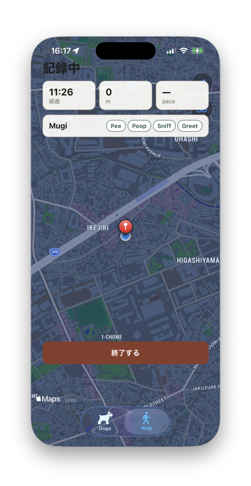
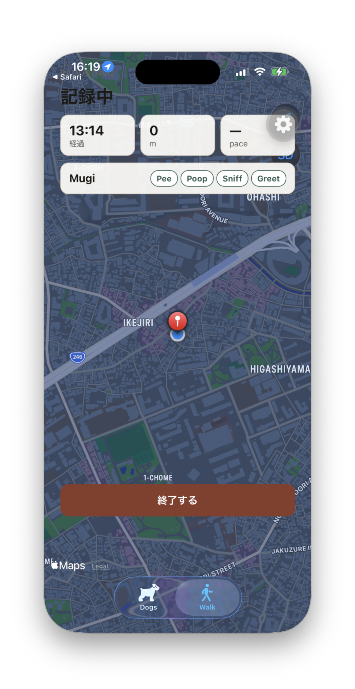
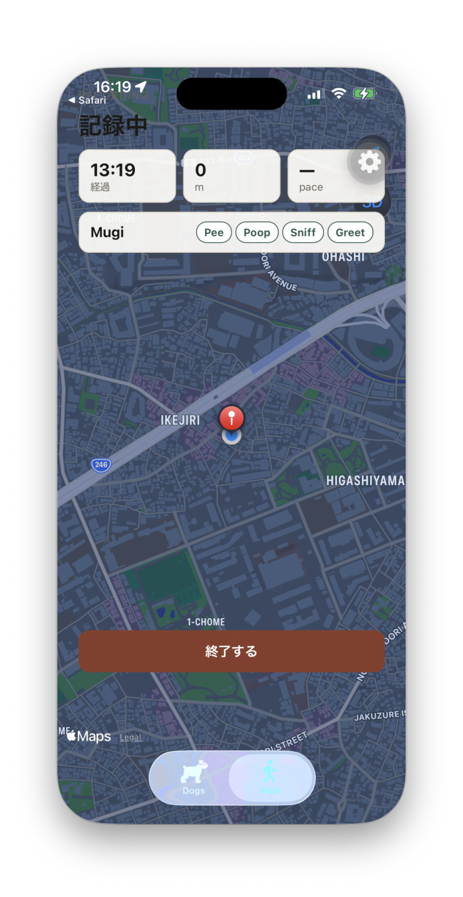
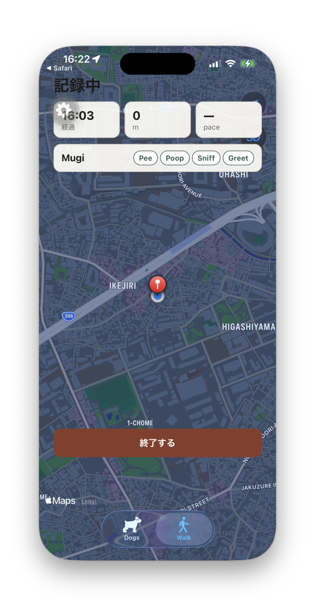
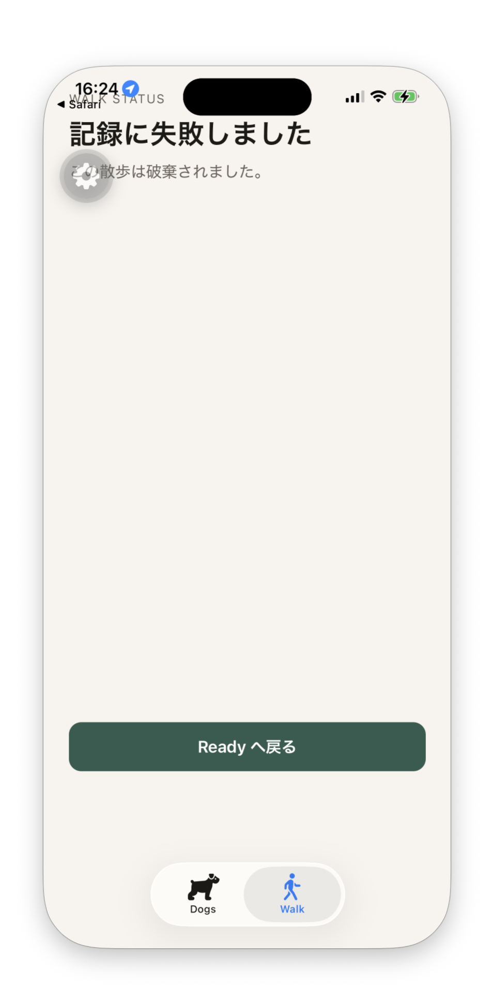
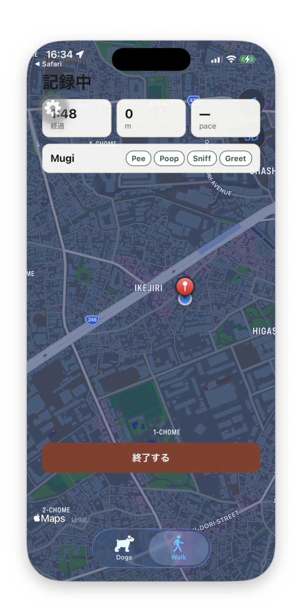

# R1 Step 7 Device Verification — iOS E2E

Physical iPhone + LAN Compose で、起動／Foreground／タブ照合、Background TrackPoint、Active 消失 → Failed、通信復帰の自動再送を確認した。シミュレータは使っていない。

## Environment

| Item | Observed value |
| --- | --- |
| Checkout | `/Users/matsuokashuhei/Development/github.com/matsuokashuhei/walk-dog/.worktrees/agent/r1-step7-device-verification-20260906172837` |
| Branch / HEAD at commit | `agent/r1-step7-device-verification-20260906172837` / `d8d2ec9` |
| Device | Shuhei’s iPhone, iPhone 14 Pro (`iPhone15,2`), iOS 26.6.2, UDID `00008120-001A2DE83A3B401E` |
| Drive method | iPhone Mirroring + Accessibility HID (`/tmp/iphone-e2e/click`). Simulator unused. |
| App | `com.cacheandbuffer.walkdog` + Metro `http://192.168.68.64:8082` |
| API URL | `EXPO_PUBLIC_API_BASE_URL=http://192.168.68.64:3000` |
| Compose health | `GET http://127.0.0.1:3000/health` 200; `GET http://192.168.68.64:3000/health` 200 |
| AWS SSO | `amazon/aws-cli sts get-caller-identity --profile walk-dog` succeeded (`matsuokashuhei`) |
| Run window | 2026-09-12 16:17–16:35 JST |

## Commands

```sh
ipconfig getifaddr en0   # 192.168.68.64
curl --fail http://127.0.0.1:3000/health
curl --fail http://192.168.68.64:3000/health
docker run --rm -v "$HOME/.aws:/root/.aws" amazon/aws-cli sts get-caller-identity --profile walk-dog
# Scenario F
docker compose -f apps/compose.yml stop api    # 2026-09-12T07:33:12Z
docker compose -f apps/compose.yml start api   # 2026-09-12T07:33:49Z
```

Visible Recording chrome is **記録中** and **終了する**. Failed chrome is **記録に失敗しました** / **この散歩は破棄されました。** / **Ready へ戻る**.

## Scenario results

| Scenario | UI evidence | API / data evidence | Result |
| --- | --- | --- | --- |
| A — Launch restore | After force-quit + relaunch, Walk shows **記録中**, elapsed 11:26, **終了する**, map + pin | Active Walk restored on Walk tab | pass |
| B — Foreground reconcile | After Background ≥15 s then return, **記録中** and **終了する** remain | Recording retained on AppState `active` | pass |
| C — Tab reconcile | Dogs → Walk returns **記録中**, elapsed 13:19, **終了する** | Same Recording after tab focus | pass |
| D — Background location | After Background ≥30 s, Walk still **記録中** (elapsed 16:03). Device stayed put so distance stayed 0 m | API accepted `POST /v1/walks/:walkId/track-points` **201** on a ~10 s cadence through 16:13–16:22 JST, including while backgrounded | pass |
| E — Active disappearance | Fresh Recording; Active removed; Dogs → Walk shows Failed title, body, and **Ready へ戻る** | Subsequent `POST .../track-points` returned **409** after Active removal | pass |
| F — Network recovery | Fresh Recording (**記録中** / **終了する**) stayed up through API stop and after restart; map visible at 16:34 | See send evidence below | pass |

### F send evidence

`POST /v1/walks` **201** at `2026-09-12T07:32:37Z`, then TrackPoints **201** every ~10 s until API stop at `07:33:12Z` (last **201** `07:33:07Z`). API was unreachable for ~37 s. On start (`07:33:49Z`, health **200** at `07:33:52Z`) the API accepted **four** `POST /v1/walks/:walkId/track-points` **201** in a burst at `07:33:51.848Z`–`07:33:52.197Z` (first duration 361 ms), then resumed the 10 s cadence (`07:34:04Z`, `07:34:16Z`). Those burst **201**s are the outbound-queue drain.

## Screenshots

### A — Launch restore



### B — Foreground reconcile



### C — Tab reconcile



### D — Background TrackPoint



### E — Active missing → Failed



### F — Network recovery


